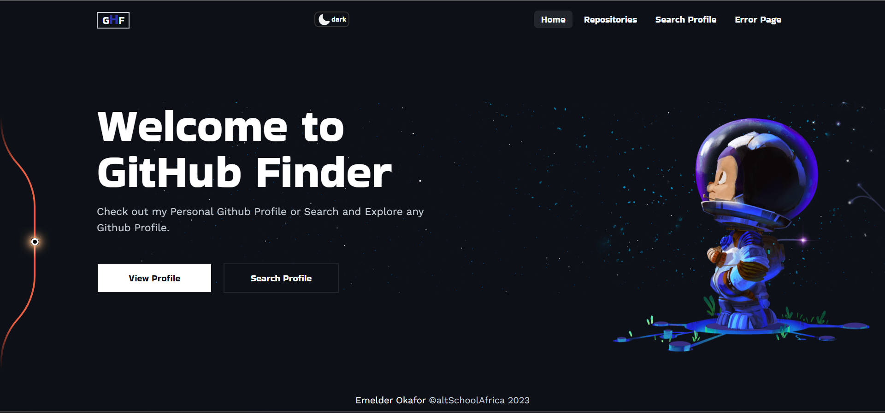

# GitHub Finder



GitHub Finder is a web application built with Vue.js that allows users to view my personal github profile information and also search for GitHub profiles. The application utilizes the GitHub API to fetch data from GitHub servers and provides a user-friendly interface for displaying the retrieved information.

## Getting Started
To use GitHub Finder, simply navigate to the home page to view my profile. You can also search for other GitHub users by using the search button on the home page, which will redirect you to the search page. Enter the username you wish to search for and click the "Search" button.

## Technologies Used
GitHub Finder was built using the following technologies and tools:
- Vue.js: A progressive JavaScript framework for building user interfaces.
- HTML: The markup language used for structuring the application.
- CSS: The styling language used for visual design.
- JavaScript: The programming language used for implementing logic and interactivity.
- Axios: A library used for making HTTP requests to the GitHub API.
- Tailwind CSS: A utility-first CSS framework for responsive design.


## Features
- Display personal GitHub profile
- Search and explore any GitHub profile
- Utilization of GitHub API endpoints using Axios
- Styling with Tailwind CSS
- Page routing with vue-router
- SEO optimization with React Helmet Async


## Installation
To run GitHub Finder locally, you need to clone the repository to your local machine and install the necessary dependencies. Follow these steps:

1. Clone the repository using the following command:

   ```bash
   git clone https://github.com/Meldy2503/vue-github-profile.git
   ```

2. Navigate to the cloned repository:

   ```bash
   cd github-finder
   ```

3. Install the dependencies:

   ```bash
   npm install
   ```

4. Start the application:

   ```bash
   npm start
   ```

   The application should now be running at http://localhost:3000.

## Contributing
Contributions to GitHub Finder are welcome and encouraged! If you would like to contribute, please fork the repository and submit a pull request with your changes.

## License
GitHub Finder is licensed under the MIT License. See [LICENSE](LICENSE) for more information.

## Project Demo
You can access the live demo of GitHub Finder at [vue-github-profile](https://vue-github-profile.vercel.app/).

## IDE Setup
For the best development experience, it is recommended to set up your IDE as follows:
- [VS Code](https://code.visualstudio.com/) with the [Volar](https://marketplace.visualstudio.com/items?itemName=Vue.volar) extension (disable Vetur) and the [TypeScript Vue Plugin (Volar)](https://marketplace.visualstudio.com/items?itemName=Vue.vscode-typescript-vue-plugin).

Thank you for using GitHub Finder. Explore GitHub profiles, view details, and enjoy searching for GitHub users effortlessly! If you have any questions or encounter any issues, please refer to the project's documentation or seek assistance from the project maintainers.
